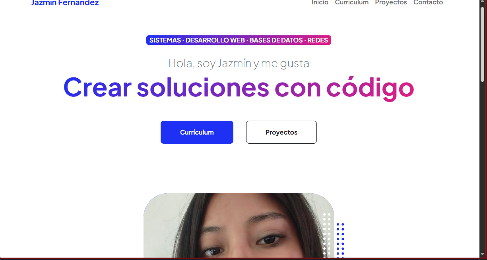
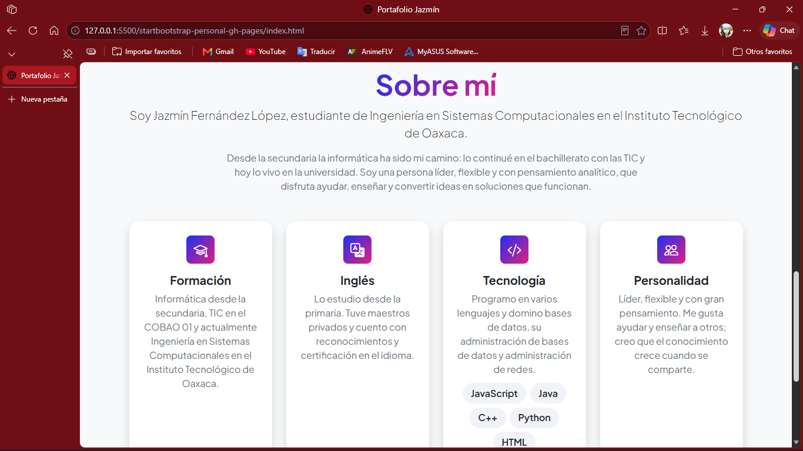
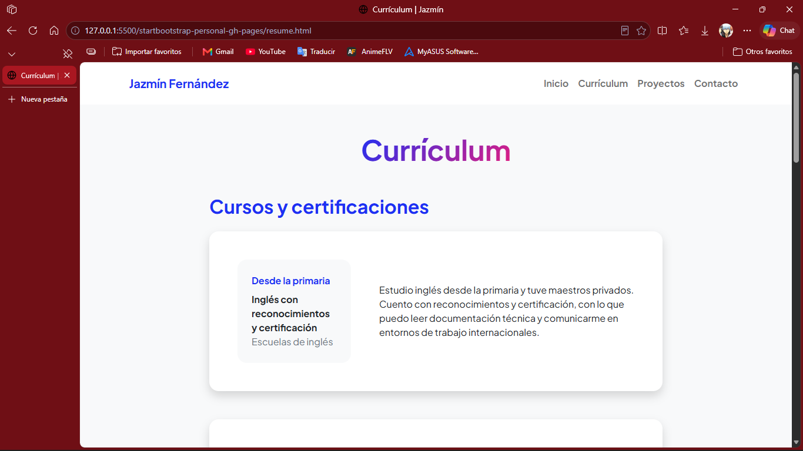
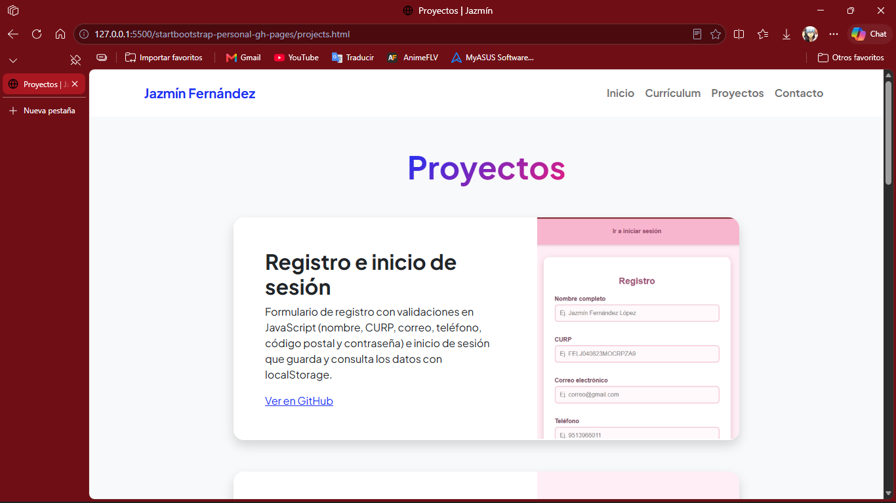
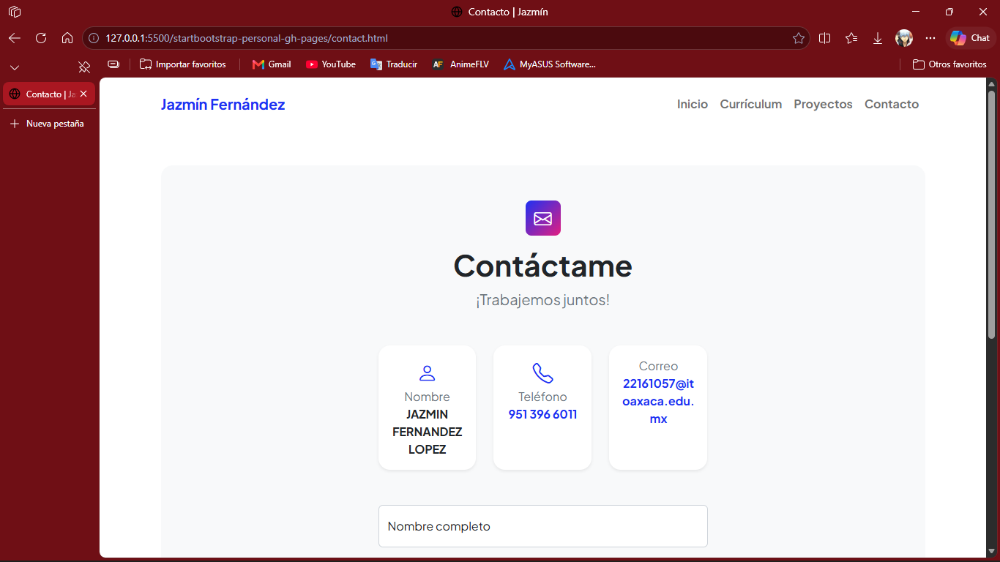

# Mi portafolio | Jazmín Fernández López

Este es mi portafolio personal. Aquí muestro quién soy, lo que estudié, lo que sé hacer y mis proyectos.
---

## Descripción del proyecto

- **Framework:** Bootstrap 5
- **Plantilla:** Personal, de Start Bootstrap
- **Dónde descargarla:** https://startbootstrap.com/theme/personal

Mi portafolio tiene 4 páginas:

 **Inicio:** mi nombre, mi foto y una parte de "Sobre mí" donde cuento un poco de mí.
**Currículum:** mis cursos, mis certificaciones, mi escuela y mis habilidades.
**Proyectos:** los proyectos que he hecho, con una foto y un link a GitHub.
**Contacto:** mi teléfono, mi correo y un formulario para escribirme.

---

## Cómo lo hice

1. Busqué una plantilla gratis de Bootstrap para portafolio y elegí Personal.
2. La descargué y la abrí en Visual Studio Code.
3. Le cambié los nombres a los archivos: `portafolio.css` y `portafolio.js`.
4. Cambié los textos por mi información: mi nombre, mi foto, mi escuela, mis cursos y mis habilidades.
5. Agregué mis proyectos con sus fotos.
6. Cambié el formulario de contacto para que abra el correo con el mensaje ya escrito.
7. Subí todo a GitHub.
8. Activé GitHub Pages para que mi página se pueda ver en internet.

---

## Capturas de pantalla

**Inicio**

**Sobre mí**

**Currículum**

**Proyectos**

**Contacto**
